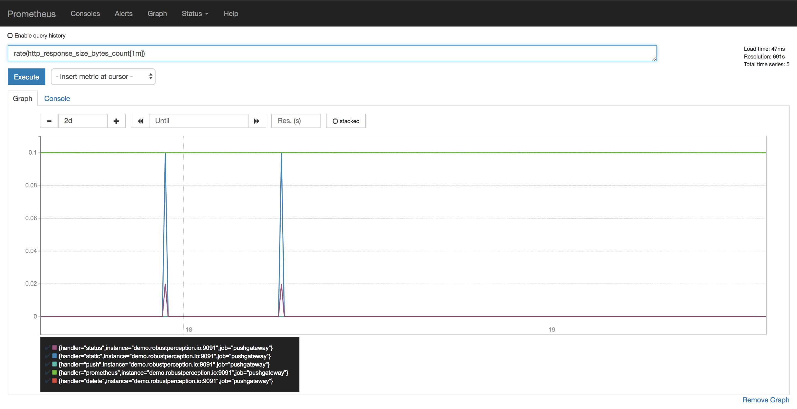
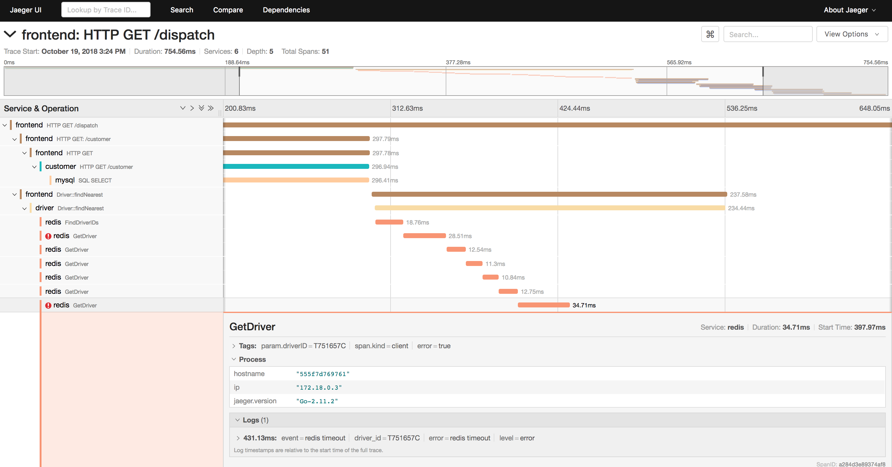

Hi! My name is [Michael](https://mhausenblas.info) and I'm a developer advocate and [cloud native ambassador](https://www.cncf.io/people/ambassadors/). Here, I share some thoughts and considerations around using cloud native technologies, including Kubernetes, observability tools such as Prometheus, service meshes,  and serverless offerings.

1. [Why?](#why)
1. [Kubernetes](#lets-talk-about-kubernetes)
1. [Observability](#lets-talk-about-observability)
1. [Service meshes](#lets-talk-about-service-meshes)
1. [Serverless](#lets-talk-about-serverless)
1. [Security](#lets-talk-about-security)

----

## Why?

### Why you would want to read this

You have heard about cloud native [technologies](https://landscape.cncf.io/) and [success](https://kubernetes.io/case-studies/) [stories](https://serverless.com/learn/use-cases/). You wonder where and how to start and get the most out of it. Congrats! You're exactly right here.

### Why I am writing this

A fair part of my work consists of being [on the road](http://mhausenblas.info/on-the-road.html), talking with folks at events, with customers on-site, meeting up with partners to understand their offerings, helping on StackOverflow and on various Slack channels. I learn something every time when I'm having these discussions and even more when someone asks me how to do something or why things are like they are. This is my attempt to share some of this knowledge, to give back to the community. Also, I wanted to have a place on the Internetz I can point people to. Talking about human scalability, ha!

## Let's talk about Kubernetes

So you want to benefit from [Kubernetes](https://kubernetes.io/), right? You want portable applications, getting features out to your customers faster, use modern deployment mechanisms, have autoscaling, and more? 

I've got good news and not so good news for you. Yes, it's totally feasible, but you gotta do your homework first. You have to first do the, surprise, boring stuff (!)

Let me walk you through it …

### Begin at the beginning

> "Begin at the beginning," the King said, very gravely, "and go on till you come to the end: then stop.”

&mdash;&mdash; [Lewis Carroll, Alice in Wonderland](https://www.goodreads.com/quotes/6305-begin-at-the-beginning-the-king-said-very-gravely-and)

So, what *is* the beginning? It starts with your team and your wider organization. Like, everyone. This is the hard part and unfortunately the technologies available can't help you there. Make sure that [developers and folks with ops roles are incentivized](https://www.usenix.org/conference/lisa16/conference-program/presentation/eckhardt) in the same direction. Go for lunch together. Talk. [Whatever it takes](https://basecamp.com/books/calm), make sure you're on the same page for what is coming. Do it now, I'll wait here …

OK. You ready?

Let's get to the "easy" stuff, the tech. Here's a little checklist, in this order:

- All of our source code is in a version control system such as Git, Mercurial, svn or whatnot.
- We know about container (base) image hygiene such as footprint, build vs runtime environment, attack surface, etc.  
- We have a CI/CD pipeline and know how to use it.
- We have a (private, secure) container registry and know how to use it.
- Our developers have either local Kubernetes environments or access to dedicated namespaces for day-to-day development.
- Our dev and ops folks have a 360 view on apps and infra, we use observability tooling everywhere.

Checked all items off the list? Pinky promise? 

Cool, you're ready …

So, what's next? Well, think about what kind of app you're doing. Is it a lift and shift of an existing app? Breaking down a monolith into a bunch of microservices? Are you writing a native app from scratch? Here are some rough guidelines and indicators for each case:

- You have a _commercially available off-the-shelf_ (COTS) app such as WordPress, Rocket Chat or whatever and you want to run it on Kubernetes. The app itself is not "aware" it runs on Kubernetes and usually doesn't have to be. Kubernetes controls the app's life cycle, that is, find node to run, pull the container image, launch container(s), carry out health checks, mount volumes, etc, and that is that. You benefit from Kubernetes as a runtime environment and that's fine.
- You write a _bespoke app_, something from scratch (with or without having had Kubernetes as the runtime environment in mind) or an existing monolith you carve up into microservice. You want to run it on Kubernetes. It's roughly the same modus operandi as in the case of the COTS app above, but with a twist:
  - Now that you have a bunch of microservices, you can ship features faster. If and only if your organization allows it. Roll out a new service and you're done. Do A/B or canary testing, leverage fine-grained security via RBAC.
  - Oh my, you have some microservices and not a single monolith now … how do you know where to look at when things are slow and/or break? See the [tracing](#tracing) section for some answers.
- The case of a _cloud native_ or _Kubernetes native_ application. That is, a an application that is "fully aware" it is running on Kubernetes and is designed to access the Kubernetes APIs and resources, at least to some extent. You don't have to go all the way to use things like the [Operator Framework](https://github.com/operator-framework), although that's also a nice goal, but you typically would leverage Kubernetes [custom resources](https://kubernetes.io/docs/concepts/extend-kubernetes/api-extension/custom-resources/) and/or write a controller that queries or manipulate Kubernetes proper resources such as pods or services.

### Kubernetes good practices

So, let's face it, there are [no best practices](https://www.forbes.com/sites/mikemyatt/2012/08/15/best-practices-arent/#6837047e407b), but over time the community documents and collects things that can maybe be called "good practice". As in: worked for me, in my setting but YMMV.

Now, here are some pointers to good practices and/or collections of such, to get you started:

1. Install:
  - [Kubernetes the hard way](https://github.com/kelseyhightower/kubernetes-the-hard-way)
  - [Managing Kubernetes](http://shop.oreilly.com/product/0636920146667.do)
1. Development:
  - [Developing on Kubernetes](https://kubernetes.io/blog/2018/05/01/developing-on-kubernetes/)
  - [Apps life cycle](http://shop.oreilly.com/product/0636920175131.do)
  - [Troubleshooting apps](http://troubleshooting.kubernetes.sh)
1. Functional areas: 
  - [Stateful Apps](http://stateful.kubernetes.sh)
  - [Network](https://mhausenblas.info/cn-ref)

## Let's talk about observability

So [observability](https://medium.com/@copyconstruct/logs-and-metrics-6d34d3026e38), sometimes also called _o11y_, because: why not? :)

I'll keep it simple and talk for now about the cloud native monitoring standard Prometheus and then continue with tracing. 

### Prometheus

It's simple. [Install it](https://prometheus.io/docs/prometheus/latest/getting_started/) and use it together with [Grafana](https://grafana.com/). Also, if you're looking for retaining your metrics in the long term, [there are options](https://github.com/mhausenblas/docs/blob/master/content/blog/2018-09-03-lts-options.md) (@@TODO: update dat link when blog post goes live).

The PromQL query language is super powerful and actually not that hard to learn, here you see it in action (kudos to Robust Perception):

Ah, one more thing in this context: keep an eye on the [OpenMetrics](https://openmetrics.io/) project. It's a relatively new CNCF project that has its roots in Prometheus and will enable interop in this space.

Some pointers to good practices and/or collections of such, to get you started:

- Read the [Prometheus: Up & Running](http://shop.oreilly.com/product/0636920147343.do) book by Brian Brazil
- Read the [Monitoring with Prometheus](https://www.prometheusbook.com/) book by James Turnbull
- [Evolution of Monitoring and Prometheus](https://www.slideshare.net/brianbrazil/evolution-of-monitoring-and-prometheus-dublin-2018)
- Try out PromQL in Robust Perception's [Prometheus demo installation](http://demo.robustperception.io:9090/graph)
- Watch videos from [PromCon](https://promcon.io/):
  - [2017](https://www.youtube.com/playlist?list=PLoz-W_CUquUlnvoEBbqChb7A0ZEZsWSXt) conference
  - [2016](https://www.youtube.com/playlist?list=PLoz-W_CUquUlCq-Q0hy53TolAhaED9vmU) conference

## Tracing

You have a bunch of (containerized?) microservices that make up your app.
Let's say that on any given request path you have a couple—maybe only 5 but maybe 20 or more—microservices involved in processing the request. How can you not only figure out which one of the many microservices on  the request path is broken (relatively straight forward) but which one is slow or busy?

Here, distributed tracing can help developer or appops and while some [experts advocate](https://twitter.com/mattklein123/status/1049813546077323264) for being conservative rolling out tracing, I can't imagine how one would successfully do microservices without tracing or something equivalent. It's like flying blind in a plane you've so far only known from the passenger cabin and you notice a warning saying that you're about to crash … and not even knowing where to look for the potential problem. Doesn't sound like a great place to be in.

Rather than trying to time-sync log entries across different nodes—good luck unless you can do [TrueTime](https://ai.google/research/pubs/pub45855)—the idea of (distributed) tracing is to assign each incoming request a unique ID (UID). This UID is passed through by each microservice touching the request, for example, using HTTP headers. The tracing tool then can stitch together the traces by looking at each invocation and knowing which microservice did what. The result is something like this (produced using [Jaeger](https://www.jaegertracing.io/)):

As it is sometimes the case in cloud native land (erm, container engines) we have not one but two CNCF projects here at our disposal, with overlapping goals but different approaches:

- [OpenCensus](https://opencensus.io/), which explains itself with being 'a vendor-agnostic single distribution of libraries to provide metrics collection and tracing for your services'.
- [OpenTracing](https://opentracing.io/), which announces itself with the headline to offer 'vendor-neutral APIs and instrumentation for distributed tracing'.

I'm not going to make a recommendation here, it's a loaded discussion, so pick which one you like or flip a coin.

Some pointers to good practices and/or collections of such, to get you started:

- [The life of a span](https://medium.com/jaegertracing/the-life-of-a-span-ee508410200b)
- [Distributed Tracing with Jaeger & Prometheus on Kubernetes](https://blog.openshift.com/openshift-commons-briefing-82-distributed-tracing-with-jaeger-prometheus-on-kubernetes/)
- Katacoda scenario on [Use OpenTracing with Golang and Hot R.O.D. demo](https://katacoda.com/opentracing/scenarios/golang-hotrod-demo)
- [Debugging Microservices: How Google SREs Resolve Outages](https://www.infoq.com/presentations/google-debug-microservices)
- [Debugging Microservices: Lessons from Google, Facebook, Lyft](https://thenewstack.io/debugging-microservices-lessons-from-google-facebook-lyft/)

## Let's talk about service meshes

> There is nothing quite so useless, as doing with great efficiency, something that should not be done at all.” 

&mdash;&mdash; [Peter Drucker](https://www.goodreads.com/author/quotes/12008.Peter_F_Drucker)

A word on maturity: we're, at time of writing this in end of 2018, with service meshes where we were between 2015 and 2017 with container orchestrators. Remember the "container orchestration wars"? We had Swarm, Mesos/Marathon and then Kubernetes came along (honorable mention: Nomad, which I very much like, just a little late to the party). It became apparent for folks that it's prolly a good idea to use a container orchestrator but it was unclear which one to pick since there was no clear winner. So folks often ended up doing home-grown combos of bash scripts and using Puppet, Chef, or Ansible to orchestrate containers. Well, with end of 2017, Kubernetes established itself as the industry standard in this realm and the discussions are nowadays kinda moot.

Again, we're early days concerning service meshes. But, if you have a non-trivial number of microservices (10? 20? 30?) and you find yourself rolling your own solution to manage observability, shape traffic, intra-service or intra-cluster mutual TLS, etc. then maybe, just maybe you're in the right place to consider a service mesh. Here are some options (in order of popularity/community size):

- [Istio](https://istio.io/): the 500 pound gorilla. Everyone seems to do it and back it. Also, make sure to [evaluate](https://tech.bigbasket.com/bigbaskets-experience-with-istio/) it carefully. 
- [Linkerd2](https://linkerd.io/2/overview/): a nice and lightweight alternative, I took a closer look at it [here](https://hackernoon.com/linkerd-2-0-service-ops-for-you-and-me-281cc5bd6424).
- [Consul Connect](https://www.hashicorp.com/blog/consul-1-2-service-mesh): can't say much since I haven't tried it but looks promising to me.

### Service mesh good practices

Some pointers to good practices and/or collections of such, to get you started:

- [The Service Mesh: Past, Present, and Future](https://kccncna17.sched.com/event/CU8M/the-service-mesh-past-present-and-future-b-william-morgan-buoyant)
- [The Enterprise Path to Service Mesh Architectures](https://blog.gingergeek.com/2018/08/now-available-the-enterprise-path-to-service-mesh-architectures/)
- [The Service Mesh](https://pages.buoyant.io/Oreilly-Service-Mesh-Book.html)
- [Introducing Istio Service Mesh for Microservices](https://developers.redhat.com/books/introducing-istio-service-mesh-microservices/)

## Let's talk about serverless

So, yeah, serverless is the 'new' kewl kid in town. It's kinda not really useful to position serverless and containers against each other since that's comparing apples and oranges but nevertheless that's often the case nowadays. Let's not go there and focus on what it is and what you can do: serverless is an umbrella term for a class of technologies, focusing on the execution and business or billing model. You're only billed by actual invocation or usage rather than a certain time on a fixed basis.

One of the most popular—or maybe it's the loudest of the kewl kids, who knows—serverless offerings is the so called Function-as-a-Service (FaaS). With AWS Lambda, Amazon has been trailblazing this area since 2014 and it is nowadays used in a range of event-driven [use cases](https://dashbird.io/blog/best-aws-lambda-serverless-use-cases/).

Whenever someone says serverless, erm, FaaS then I usually ask: _Where?_ 

In the public cloud such as AWS Lambda or Azure Functions or [on top of Kubernetes](https://go-talks.appspot.com/github.com/mhausenblas/2018-state-of-faas-on-kube/main.slide)? Also, one should not underestimate the fact that there are certain [challenges](https://hackernoon.com/serverless-whos-on-call-now-81193fbfe9d7) that come along with it; though, in all fairness, some do overlap with containers.

I've been active in serverless land for a couple of years now and recently asked myself how does the same app look as [a monolith, as a containerized microservice app, and using FaaS](https://speakerdeck.com/mhausenblas/three-billy-goats-gruff-from-a-monolith-to-containers-to-functions).

### Serverless good practices

Some pointers to good practices and/or collections of such, to get you started:

- O’Reilly has a great collection of resources here with [Learn about serverless with these books, videos, and tutorials](https://www.oreilly.com/ideas/learn-about-serverless-with-these-books-videos-and-tutorials)
- Read from and listen to Mr [Paul Johnston](https://medium.com/@PaulDJohnston) 
- Attend one of the dozens [Serverless conferences](http://serverlessconf.io/) around the world

## Let's talk about security

Oh boy. So, I'm currently reading [Bruce Schneier: "Click Here to Kill Everybody"](https://www.youtube.com/watch?v=GkJCI3_jbtg) and while it's not that bad in cloud native land, I think, we certainly still have a lot in front of.

In the context of Kubernetes, Liz Rice and I have collected and documented relevant security resources at [kubernetes-security.info](https://kubernetes-security.info/) and there's also a short book for your to download.

For serverless/FaaS, I'd suggest you check out Yan Cui's excellent post [Many-faced threats to Serverless security](https://hackernoon.com/many-faced-threats-to-serverless-security-519e94d19dba) and maybe have a look at this very informative Black Hack 2017 talk on [Hacking Serverless Runtimes: Profiling AWS Lambda Azure Functions & More](https://www.youtube.com/watch?v=GZBiz-0t5KA) with a slide deck [here](https://www.blackhat.com/docs/us-17/wednesday/us-17-Krug-Hacking-Severless-Runtimes.pdf).